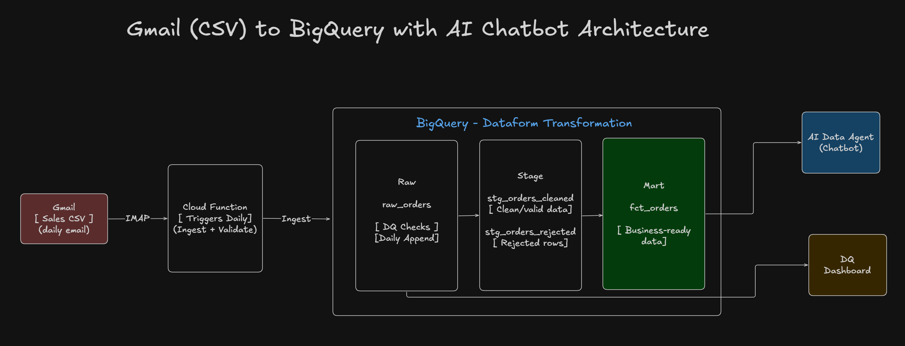
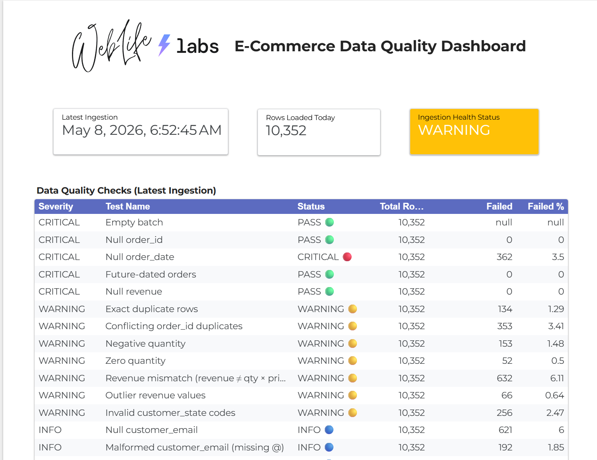

# Weblife E-Commerce Data Engineering Assessment

> **Take-Home Assessment — Data & AI Engineer (GCP)**
> End-to-end data platform: Gmail ingestion → BigQuery transformation → plain-English AI chatbot.


---

## Demo & Walkthrough

| | |
|---|---|
| **Video Walkthrough (Loom)** | https://www.loom.com/share/9ba261dfccd1465b837893f1fc4ee1f7 |
| **Data Quality Dashboard** | _https://datastudio.google.com/reporting/701860c2-5e1e-4468-8371-6b6ca5150874_ |
| **Live Chatbot** | _https://weblifes-submission-gcp.onrender.com_ |

<br>

---
<br>

## The Problem

You've just joined the BI team at an e-commerce company selling home and outdoor products across multiple US online stores. Everything runs on GCP with BigQuery as the warehouse.

**Here's what you're walking into:**

**The pipeline is manual.**
Every morning, someone downloads CSV exports and uploads them to BigQuery by hand.
No automation. No scheduling. No error handling.
If someone forgets or is on leave, the data doesn't get loaded.

**The data isn't trusted.**
The marketing team has spotted duplicate orders, missing dates, and products showing up under different names.
Nothing catches these issues before they hit the dashboards.
Stakeholders are losing confidence in the reports.

**Analysts are a bottleneck.**
Every time someone needs a number — "what was revenue last month?" or "which store is performing best?" — they have to ask the BI team and wait.
Non-technical users have no way to get answers on their own.

**Your manager asks you to fix all of it. On GCP. With BigQuery as the destination.**

<br>

---
<br>

## The Solution

| Problem | What Was Built |
|---|---|
| Manual daily uploads | Automated Gmail → BigQuery ingestion pipeline, scheduled via Cloud Functions + Cloud Scheduler |
| No error handling or alerting | 5-scenario Gmail alert system covering failures, duplicates, missing files, and daily quality reports |
| Dirty data reaching dashboards | 14 DQ checks across 3 severity levels; quarantine table for rejected rows; staging layer with dedup, type-casting, and canonicalisation |
| No self-serve analytics | Plain-English AI chatbot backed by Claude + BigQuery — anyone can ask questions and get answers instantly |

<br>

---
<br>

## Assumptions

- The source system sends one email per day with a single CSV attachment named `e_com_sales_YYYYMMDD.csv`
- The email subject follows the format `[E-Com] Daily Sales Export – YYYY-MM-DD` exactly
- I've generated the datasets with the help of Claude mimicing real world mess.

<br>

---
<br>

## Approach

### Deliverable Order

Built in dependency order: ingestion first (nothing else works without data), transformations second (the chatbot needs clean data), chatbot last.

### Test Data

Realistic sales data was generated using **Claude Code** — 5 stores, 20 products across 5 categories, ~3 years of daily orders with intentional noise (typos in store names, casing variants, occasional duplicate rows, missing fields, revenue mismatches). This let every layer of the pipeline be tested against data that behaved like real source system output, not a clean synthetic fixture.

### Development with Claude Code

The entire project was built using **[Claude Code](https://claude.ai/code)** as an AI coding assistant throughout the development process.

Claude Code significantly accelerated the workflow:

- **Boilerplate elimination** — scaffolding for Cloud Functions, Dataform models, Chainlit handlers, and Dockerfiles was generated and immediately functional rather than written from scratch
- **Error diagnosis** — runtime errors (credential resolution, Chainlit 2.x API changes, PyArrow type mapping) were diagnosed and fixed in context without losing momentum
- **Pattern consistency** — the same conventions (logging, error handling, env var loading, alert structure) were applied uniformly across all files without manual cross-referencing
- **Documentation** — docstrings, inline comments, and this README were written alongside the code rather than as a separate pass at the end

All generated code was reviewed, understood, and tested before being committed. Claude Code made the process faster and more consistent — it did not replace the engineering judgment behind the architecture and design decisions.

<br>

---
<br>

## Table of Contents

1. [Architecture Overview](#1-architecture-overview)
2. [Project Structure](#2-project-structure)
3. [Deliverable 1 — Gmail → BigQuery Ingestion Pipeline](#3-deliverable-1--gmail--bigquery-ingestion-pipeline)
4. [Deliverable 2 — Data Quality Checks & Transformations](#4-deliverable-2--data-quality-checks--transformations)
5. [Deliverable 3 — AI Insights Chatbot](#5-deliverable-3--ai-insights-chatbot)
6. [Local Development Setup](#6-local-development-setup)
7. [Deploying to Google Cloud](#7-deploying-to-google-cloud)
8. [Deploying the Chatbot to Render](#8-deploying-the-chatbot-to-render)
9. [Environment Variables Reference](#9-environment-variables-reference)
10. [Alerting System](#10-alerting-system)
11. [In a Real Production Environment](#12-in-a-real-production-environment)

<br>

---
<br>

## 1. Architecture Overview

> **Architecture Diagram**




<br>

---
<br>

## 2. Project Structure

```
weblifes-submission-gcp/
│
├── gmail_bigquery_ingestion_pipeline/   # Deliverable 1
│   ├── main.py                          # Cloud Function HTTP entry point
│   ├── requirements.txt
│   └── utils/
│       ├── config.py                    # Env vars via python-dotenv
│       ├── gmail_reader.py              # IMAP client + two-stage filtering
│       ├── attachment_parser.py         # CSV bytes → pandas DataFrame
│       ├── bq_loader.py                 # Table management & load
│       ├── pipeline.py                  # Orchestrator (fetch → parse → load)
│       ├── alerting.py                  # Gmail SMTP alerts (5 scenarios)
│       ├── date_helpers.py              # Date parsing utilities
│       └── logging_config.py
│
├── bigquery_transformations/            # Deliverable 2
│   ├── create_schema.sql                # DDL for all 4 BigQuery tables
│   ├── data_quality/
│   │   └── dq_checks.sql               # 14 DQ checks (critical / warning / info)
│   ├── sources/
│   │   └── raw_orders.sqlx             # Dataform source declaration
│   ├── staging/
│   │   ├── stg_orders_cleaned.sqlx     # Dedup, type-cast, canonicalise
│   │   └── stg_orders_rejected.sqlx    # Quarantine table
│   └── mart/
│       └── fct_orders.sqlx             # Pre-aggregated daily fact table
│
├── insights_chatbot/                    # Deliverable 3
│   ├── app.py                           # Chainlit entry point
│   ├── Dockerfile
│   ├── requirements.txt
│   ├── .env.example
│   ├── .chainlit/
│   │   └── config.toml                  # Branding & UI settings
│   └── utils/
│       ├── config.py                    # Chatbot env vars
│       ├── llm.py                       # Claude agentic loop + streaming
│       ├── bq_client.py                 # Read-only BigQuery execution
│       └── schema.py                    # Table schema + system prompt
│
├── auth/
│   └── service_account.json             # GCP credentials (gitignored)
│
├── .env                                 # Local secrets (gitignored)
├── render.yaml                          # Render deployment config
└── CLAUDE.md                            # AI assistant instructions
```

<br>

---
<br>

## 3. Deliverable 1 — Gmail → BigQuery Ingestion Pipeline

Fetches the latest daily sales CSV from Gmail and loads it into BigQuery.

Triggered daily via Cloud Scheduler → Cloud Functions.

### How It Works

```
Cloud Scheduler (cron)
        │
        ▼
Cloud Function (main.py)
        │
        ├─► gmail_reader.py        ── IMAP search → regex match → latest email
        ├─► attachment_parser.py   ── CSV bytes → pandas DataFrame (all str)
        ├─► bq_loader.py
        │       ├── ensure_table()         ── create table if first run
        │       ├── is_already_ingested()  ── idempotency check by filename
        │       └── load()                 ── PyArrow → BigQuery append
        └─► alerting.py            ── Gmail SMTP alert on each outcome
```

### Key Design Decisions

**Two-stage email filtering**

Stage 1 is an IMAP server-side `SUBJECT` search — fast and permissive.
Stage 2 applies a Python regex client-side for an exact match.
Both patterns are independently configurable via env vars.

```python
GMAIL_SUBJECT_FILTER  = "[E-Com] Daily Sales Export"
GMAIL_SUBJECT_PATTERN = r"^\[E-Com\] Daily Sales Export\s*[–-]\s*\d{4}-\d{2}-\d{2}$"
```

**Raw schema is all-STRING**

No type coercion at the landing layer.
All 17 source columns land as `STRING`.
Types are applied in staging, where the business logic lives.

**Idempotency** (Very Important)

Before parsing the CSV, the pipeline queries `_source_filename` in BigQuery.
If the file is already present it skips and alerts.
Returns `False` when the table doesn't exist yet — no special-casing needed on first run.

**Credentials**

- Local dev: set `GOOGLE_APPLICATION_CREDENTIALS` to your service account JSON path
- GCP Cloud Functions: leave unset — the client uses Workload Identity / ADC automatically

### BigQuery Raw Table Schema

| Column | Type | Notes |
|---|---|---|
| `order_id` | STRING | |
| `order_date` | STRING | Cast to DATE in staging |
| `customer_id` | STRING | |
| `customer_name` | STRING | |
| `customer_email` | STRING | |
| `customer_city` | STRING | |
| `customer_state` | STRING | |
| `product_name` | STRING | |
| `product_category` | STRING | |
| `quantity` | STRING | |
| `unit_price` | STRING | |
| `discount_amount` | STRING | |
| `revenue` | STRING | |
| `store_name` | STRING | |
| `shipping_method` | STRING | |
| `shipping_status` | STRING | |
| `payment_method` | STRING | |
| `_ingested_at` | TIMESTAMP | Auto-set at load time |
| `_source_filename` | STRING | Idempotency key |
| `_pipeline_run_date` | DATE | Partition key (DAY) |
| `_email_received_date` | STRING | From email `Date` header |

<br>

---
<br>

## 4. Deliverable 2 — Data Quality Checks & Transformations

SQL-based transformation layer using Dataform (`.sqlx`).

Runs daily after ingestion to promote clean data from raw → staging → mart.

### Transformation Layers

```
raw_orders  (all-STRING, append-only)
     │
     ▼
stg_orders_cleaned  (typed, deduped, canonicalised)
     │
     ├──► stg_orders_rejected  (quarantine: rows that fail DQ)
     │
     ▼
fct_orders  (pre-aggregated daily fact table)
```

### Data Quality Checks

14 checks in `bigquery_transformations/data_quality/dq_checks.sql`.

**CRITICAL — promotion is blocked**

| ID | Check | Why |
|---|---|---|
| C1 | Empty batch | Zero rows in today's file |
| C2 | Null `order_id` | Row is untrackable |
| C3 | Null `order_date` | Breaks all time-based reports |
| C4 | Future-dated orders | Clock skew or data-entry error |
| C5 | Null `revenue` | No financial metrics possible |

**WARNING — data lands, investigation needed**

| ID | Check |
|---|---|
| W1 | Exact duplicate rows |
| W2 | Conflicting `order_id` duplicates |
| W3 | Negative quantity |
| W4 | Zero quantity |
| W5 | Revenue mismatch (`qty × price − discount` differs by > $0.02) |
| W6 | Outlier revenue (< $0.01 or > $5,000) |
| W7 | Invalid `customer_state` (not a US 2-letter code) |

**INFO — expected, no action required**

| ID | Check |
|---|---|
| I1 | Null `customer_email` (expected for guest orders) |
| I2 | Malformed email format |

> **Data Quality Dashboard**
>
> 

### Staging Transformations (`stg_orders_cleaned`)

1. **Deduplication** — exact duplicates removed; conflicting `order_id`s resolved by keeping the most recent row
2. **Type casting** — `order_date → DATE`, `quantity → INT64`, `unit_price / discount_amount / revenue → NUMERIC`
3. **Canonicalisation** — store names, product names, categories, and US state codes mapped to canonical values via regex
4. **Revenue correction** — if source revenue differs from `qty × price − discount` by > $0.02, recomputed and flagged with `_revenue_was_corrected = TRUE`
5. **Quarantine** — rows failing any critical check written to `stg_orders_rejected` with a pipe-delimited `rejection_reason`

### Fact Table (`fct_orders`)

**Grain:** `order_date × store_name × product_category × product_name × shipping_status`

**Metrics:** `total_orders`, `total_units_sold`, `unique_customers`, `total_revenue`, `total_discounts_given`, `discount_rate_pct`

**Time dimensions:** `order_year`, `order_month`, `order_year_month` (YYYY-MM), `order_day_of_week`

**Clustered by** `store_name`, `product_category` for fast BI queries.

<br>

---
<br>

## 5. Deliverable 3 — AI Insights Chatbot

Conversational analytics interface built with Chainlit and Claude.

Users ask questions in plain English. The agent writes BigQuery SQL, executes it, and explains the results.

> **Chatbot Screenshot**
>
> 
>
> 

### Features

- **Natural language → SQL** — Claude translates business questions into BigQuery Standard SQL
- **Streaming responses** — answers appear token-by-token as Claude generates them
- **Transparent SQL** — every query is shown in a collapsible step with the row count
- **Conversation memory** — multi-turn context maintained within a session
- **Read-only guardrails** — only `SELECT` is allowed; `INSERT`, `UPDATE`, `DELETE`, `DROP` etc. are blocked
- **Auto-LIMIT** — queries without a `LIMIT` clause get `LIMIT 500` appended automatically
- **Quick starters** — four one-click prompts on load

| Starter |
|---|
| How did we do last month? |
| Which product is selling the most? |
| Which store is performing best? |
| Compare revenue across stores this year |

### How It Works

```
User message
     │
     ▼
Claude (tool-use loop, max 5 rounds)
     │
     ├── Stream text tokens → UI
     │
     ├── Tool call detected → execute SQL on BigQuery
     │       ├── Yield sql event    → show query in Step
     │       └── Yield result event → show row count in Step
     │
     └── Loop until end_turn
```

Claude uses a single tool — `query_orders` — which takes a SQL string, validates it, and returns a markdown table.

<br>

---
<br>

## 6. Local Development Setup

### Prerequisites

- Python 3.11+
- GCP project with BigQuery enabled
- GCP service account with `BigQuery Data Editor`, `BigQuery Job User` and `BigQuery Data Viewer` roles
- Gmail account with IMAP enabled and an [App Password](https://support.google.com/accounts/answer/185833) generated
- [Anthropic API key](https://console.anthropic.com) (for the chatbot)

### Step 1 — Clone the repository

```bash
git clone https://github.com/<your-username>/weblifes-submission-gcp.git
cd weblifes-submission-gcp
```

### Step 2 — Create a virtual environment

```bash
python -m venv .venv

# Windows
.venv\Scripts\activate

# macOS / Linux
source .venv/bin/activate
```

### Step 3 — Place your service account key

Save your GCP service account JSON as:

```
auth/service_account.json
```

This path is already gitignored. **Never commit credentials.**

### Step 4 — Configure environment variables

Create `.env` at the repo root:

```env
# Gmail IMAP
GMAIL_HOST=imap.gmail.com
GMAIL_PORT=993
GMAIL_EMAIL=your_email@gmail.com
GMAIL_APP_PASSWORD=abcd efgh ijkl mnop

# Email filtering
GMAIL_SUBJECT_FILTER=[E-Com] Daily Sales Export
GMAIL_SUBJECT_PATTERN=^\[E-Com\] Daily Sales Export\s*[–-]\s*\d{4}-\d{2}-\d{2}$
GMAIL_CSV_PATTERN=^e_com_sales_\d{8}\.csv$

# Google Cloud / BigQuery
GOOGLE_APPLICATION_CREDENTIALS=D:\path\to\auth\service_account.json
BQ_PROJECT_ID=your-gcp-project-id
BQ_DATASET_ID=weblife_ecommerce
BQ_RAW_TABLE=raw_orders

# Alerting — leave empty to disable
ALERT_RECIPIENT_EMAIL=your_email@gmail.com

# Chatbot only
ANTHROPIC_API_KEY=sk-ant-...
CLAUDE_MODEL=claude-haiku-4-5-20251001
```

### Step 5 — Install dependencies

**Pipeline:**

```bash
cd gmail_bigquery_ingestion_pipeline
pip install -r requirements.txt
```

**Chatbot:**

```bash
cd insights_chatbot
pip install -r requirements.txt
```

### Step 6 — Create BigQuery tables

```bash
bq query --project_id=your-gcp-project-id \
         --use_legacy_sql=false \
         < bigquery_transformations/create_schema.sql
```

Or paste [create_schema.sql](bigquery_transformations/create_schema.sql) directly into the BigQuery console.

### Step 7 — Run the ingestion pipeline loally

```bash
cd gmail_bigquery_ingestion_pipeline
python -m utils.pipeline
```

Expected output:

```
INFO  - Pipeline started
INFO  - Found email: [E-Com] Daily Sales Export – 2024-01-15
INFO  - Parsing attachment: e_com_sales_20240115.csv
INFO  - Loaded 4 823 rows into weblife_ecommerce.raw_orders
INFO  - Quality report sent to your_email@gmail.com
INFO  - Pipeline completed successfully
```

### Step 8 — Run the chatbot

```bash
cd insights_chatbot
chainlit run app.py
```

Open [http://localhost:8000](http://localhost:8000).


<br>

---
<br>

## 7. Deploying to Google Cloud

### Prerequisites

- [Google Cloud CLI](https://cloud.google.com/sdk/docs/install) installed and authenticated
- Cloud Functions, Cloud Build, and Cloud Scheduler APIs enabled in GCP cloud.

### Deploy the Cloud Function

```bash
gcloud functions deploy ingest \
  --gen2 \
  --region=us-central1 \
  --runtime=python311 \
  --source=gmail_bigquery_ingestion_pipeline \
  --entry-point=ingest \
  --trigger-http \
  --no-allow-unauthenticated \
  --set-env-vars GMAIL_EMAIL=your@gmail.com,\
GMAIL_APP_PASSWORD="abcd efgh ijkl mnop",\
GMAIL_SUBJECT_FILTER="[E-Com] Daily Sales Export",\
BQ_PROJECT_ID=your-gcp-project-id,\
BQ_DATASET_ID=weblife_ecommerce,\
BQ_RAW_TABLE=raw_orders,\
ALERT_RECIPIENT_EMAIL=your@gmail.com
```

> Do **not** set `GOOGLE_APPLICATION_CREDENTIALS` on GCP — the function uses Workload Identity automatically.
> Grant the function's service account `BigQuery Data Editor` and `BigQuery Job User`.

### Schedule with Cloud Scheduler

```bash
gcloud scheduler jobs create http daily-ingestion \
  --location=us-central1 \
  --schedule="0 7 * * *" \
  --uri="https://REGION-PROJECT_ID.cloudfunctions.net/ingest" \
  --oidc-service-account-email=YOUR_SA@PROJECT.iam.gserviceaccount.com \
  --time-zone="UTC"
```

### Run BigQuery Transformations

```bash
# Option A — Dataform (recommended)
# Connect this repo in the GCP Dataform console and run the workflow

# Option B — Direct execution
bq query --use_legacy_sql=false < bigquery_transformations/staging/stg_orders_cleaned.sqlx
bq query --use_legacy_sql=false < bigquery_transformations/mart/fct_orders.sqlx
```

<br>

---
<br>

## 8. Deploying the Chatbot to Render

### Step 1 — Push repository to GitHub

Render connects to your GitHub account to pull source code.

### Step 2 — Create a Web Service on Render

1. [Render dashboard](https://dashboard.render.com) → **New → Web Service**
2. Connect your GitHub repository
3. Render detects `render.yaml` and pre-fills the settings automatically

### Step 3 — Set secret environment variables

In **Environment** on the Render dashboard, add:

| Variable | Value |
|---|---|
| `ANTHROPIC_API_KEY` | Your Anthropic API key |
| `GOOGLE_CREDENTIALS_JSON` | Full contents of `service_account.json` as a single-line JSON string |

`BQ_PROJECT_ID` and `CLAUDE_MODEL` are already set in `render.yaml`.

### Step 4 — Deploy

Click **Deploy**, or push a commit — Render auto-deploys on push.

<br>

### Deploying to Cloud Run (Production GCP)

```bash
# Build and push
gcloud builds submit insights_chatbot/ \
  --tag=gcr.io/YOUR_PROJECT/weblife-chatbot

# Deploy
gcloud run deploy weblife-chatbot \
  --image=gcr.io/YOUR_PROJECT/weblife-chatbot \
  --region=us-central1 \
  --platform=managed \
  --allow-unauthenticated \
  --set-env-vars ANTHROPIC_API_KEY=sk-ant-...,BQ_PROJECT_ID=YOUR_PROJECT,CLAUDE_MODEL=claude-haiku-4-5-20251001 \
  --port=8080
```

> Do **not** set `GOOGLE_CREDENTIALS_JSON` on Cloud Run — grant the service account `BigQuery Data Viewer` and `BigQuery Job User` and Workload Identity handles auth.

<br>

---
<br>

## 9. Environment Variables Reference

### Pipeline

| Variable | Required | Default | Description |
|---|---|---|---|
| `GMAIL_HOST` | No | `imap.gmail.com` | IMAP server |
| `GMAIL_PORT` | No | `993` | IMAP SSL port |
| `GMAIL_EMAIL` | **Yes** | — | Gmail address; also used as SMTP sender |
| `GMAIL_APP_PASSWORD` | **Yes** | — | 16-character Gmail App Password |
| `GMAIL_SUBJECT_FILTER` | No | `[E-Com] Daily Sales Export` | IMAP substring search |
| `GMAIL_SUBJECT_PATTERN` | No | See `.env.example` | Python regex for exact subject match |
| `GMAIL_CSV_PATTERN` | No | `^e_com_sales_\d{8}\.csv$` | Regex matched against attachment filenames |
| `GOOGLE_APPLICATION_CREDENTIALS` | Local only | — | Path to service account JSON; omit on GCP |
| `BQ_PROJECT_ID` | **Yes** | — | GCP project ID |
| `BQ_DATASET_ID` | **Yes** | — | BigQuery dataset |
| `BQ_RAW_TABLE` | No | `raw_orders` | BigQuery table name |
| `ALERT_RECIPIENT_EMAIL` | No | — | Alert destination; leave blank to disable |

### Chatbot

| Variable | Required | Default | Description |
|---|---|---|---|
| `ANTHROPIC_API_KEY` | **Yes** | — | Anthropic API key |
| `CLAUDE_MODEL` | No | `claude-haiku-4-5-20251001` | Claude model ID |
| `GOOGLE_CREDENTIALS_JSON` | Option 1 | — | Full service account JSON string (Render / PaaS) |
| `GOOGLE_APPLICATION_CREDENTIALS` | Option 2 | — | Path to service account JSON (local dev) |
| `BQ_PROJECT_ID` | **Yes** | — | GCP project ID |

**Credential precedence:** `GOOGLE_CREDENTIALS_JSON` → `GOOGLE_APPLICATION_CREDENTIALS` → ADC (Cloud Run).

<br>

---
<br>

## 10. Alerting System

All alerts sent via Gmail SMTP (port 587, STARTTLS) using the same credentials as the IMAP reader.

Alerting is disabled when `ALERT_RECIPIENT_EMAIL` is unset. Alert failures are non-fatal — logged as warnings only.

| Scenario | Function | HTTP Response |
|---|---|---|
| No matching email in inbox | `send_no_email_alert` | `200 no_email` |
| Email found but no CSV attachment | `send_no_attachment_alert` | `200 no_attachment` |
| File already loaded (duplicate run) | `send_already_ingested_alert` | `200 already_ingested` |
| BigQuery / system error | `send_failure_alert` | `500 error` |
| Successful load | `send_quality_report` (HTML) | `200 success` |

The quality report email includes: row count, duplicate `order_id` count, full duplicate row count, and per-column empty-value counts with percentages.

> 
>
> 
>
> 

---

## Tech Stack

| Component | Technology |
|---|---|
| Ingestion | Python 3.11, pandas, PyArrow, google-cloud-bigquery |
| Email | Gmail IMAP (imaplib) + SMTP (smtplib, STARTTLS) |
| Transformations | BigQuery Standard SQL, Dataform (.sqlx) |
| Chatbot UI | [Chainlit](https://chainlit.io) 2.x |
| AI / LLM | [Anthropic Claude](https://www.anthropic.com) — tool use + streaming |
| Scheduler | Google Cloud Scheduler |
| Compute | Google Cloud Functions (2nd gen) + Cloud Run |
| Deployment | [Render](https://render.com) (Docker) / Google Cloud Run |
| Auth | Service account JSON / Application Default Credentials |

<br>

---
<br>

## 11. My Approach For A Real Production Environment (Without Sandbox Limits)

### SLAs and Ingestion Contracts

In production, reliability starts with a formal SLA agreed with the source system.

- **Email delivery SLA** — source system delivers the CSV email by **06:00 UTC** each day
- **Ingestion SLA** — pipeline completes loading to `raw_orders` by **06:30 UTC**
- **Transformation SLA** — staging and mart tables are query-ready by **07:00 UTC**
- **Late-delivery alert** — if the email has not arrived by **06:15 UTC**, an alert fires to the data team and the source system owner while there is still time to act
- **On-call runbook** — documented steps for each failure scenario so any engineer on rotation can respond

---

### Ingestion on Cloud Functions + Cloud Scheduler

- Gmail API (GCP-native) replaces the IMAP library for inbox access
- **Cloud Function (2nd gen)** hosts `main.py`, triggered via OIDC-authenticated HTTP
- **Cloud Scheduler** fires at **05:45 UTC** — 15 minutes before the email SLA deadline
- Service account granted only `BigQuery Data Editor` and `BigQuery Job User` — least privilege
- Secrets stored in **Secret Manager**, not environment variables
- Log-based metrics (`rows_loaded`, `rows_rejected`, `pipeline_latency_seconds`) feed a Cloud Monitoring dashboard

```
Cloud Scheduler (05:45 UTC)
        │  OIDC-authenticated HTTP
        ▼
Cloud Function — ingest()
        ├── Gmail API fetch
        ├── CSV parse + validate
        └── BigQuery load → raw_orders
```

---

### Dataform on Schedule

- **Dataform workflow** triggered by Cloud Scheduler after ingestion completes
- DAG ordering enforced automatically — staging runs before mart, quarantine runs in parallel
- **Dataform assertions** (`not_null`, `unique`, `accepted_values`) run before each model is materialised — a failed assertion blocks promotion and fires a Slack alert
- Workflow runs at **06:15 UTC**; mart tables ready by **06:45 UTC**

```
Cloud Scheduler (06:15 UTC)
        ▼
Dataform Workflow
        ├── stg_orders_cleaned   (assertions run first)
        ├── stg_orders_rejected  (quarantine, parallel)
        └── fct_orders           (only after staging passes)
```

---

### Incremental Mart Updates with Partitioning and Clustering

The current `fct_orders` model does a full rebuild each run — expensive at scale since BigQuery charges per bytes scanned.

In production, a daily **incremental MERGE** touches only today's partition and upsert:

```sql
MERGE INTO fct_orders AS target
USING (
    SELECT
        order_date, store_name, product_category,
        product_name, shipping_status,
        COUNT(DISTINCT order_id)    AS total_orders,
        SUM(quantity)               AS total_units_sold,
        COUNT(DISTINCT customer_id) AS unique_customers,
        SUM(revenue)                AS total_revenue,
        SUM(discount_amount)        AS total_discounts_given
    FROM stg_orders_cleaned
    WHERE order_date = CURRENT_DATE()
    GROUP BY 1,2,3,4,5
) AS source
ON  target.order_date  = source.order_date
AND target.store_name  = source.store_name
AND target.product_name = source.product_name
WHEN MATCHED     THEN UPDATE SET ...
WHEN NOT MATCHED THEN INSERT ...;
```

**Partitioning** on `order_date` (DAY) — MERGE touches only today's partition, not the full history.

**Clustering** on `(store_name, product_category)` — queries filtering by store or category skip irrelevant storage blocks entirely.

A daily refresh scans roughly 1/365th of the table compared to a full rebuild.

---

### Data Quality Alerts from BigQuery / Looker to Slack

Production DQ alerting lives at the data layer, not in application code.

**Option 1 — BigQuery scheduled query + Slack webhook**

A scheduled query runs DQ checks after each Dataform run, writes results to a `dq_results` table, and calls a Slack webhook when any CRITICAL check fails — linking directly to the failing rows.

**Option 2 — Looker dashboard + Looker Alerts**

A Looker dashboard surfaces all 14 DQ check results, rejection rates by day, and per-column empty-value trends.
Looker Pro built-in Alert feature sends Slack or email notifications when any metric crosses a threshold.
Every alert links directly to the dashboard tile for immediate investigation context.

Both options make data quality visible to analysts and product managers — not just engineers with Cloud Logging access.

---

### Chatbot via BigQuery Agents in Looker

The Chainlit + Claude prototype works well as a standalone deployment.

In a full Weblife analytics stack, the chatbot would be built natively in **Looker**:

- **Looker's semantic layer** understands metric definitions, dimension labels, and join paths — SQL is correct by construction
- **BigQuery Gemini-powered agents** provide natural-language-to-SQL without hosting a separate service
- **Access control inherited from Looker** — users query only data their role permits, no separate auth layer needed
- **Results saveable to dashboards** directly from the conversation
- Eliminates the operational burden of running and scaling a separate Chainlit service

The Chainlit prototype remains the right choice outside a Looker stack, or for a standalone public-facing product.

---

## License

This project is submitted as a take-home assessment and is not licensed for public use.